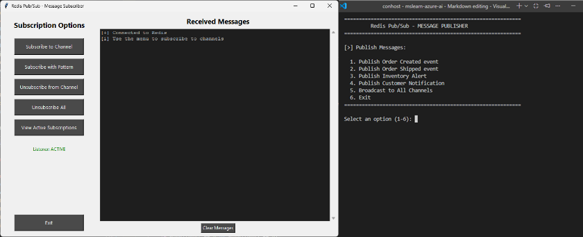

---
lab:
  topic: Azure Managed Redis
  title: Azure Managed Redis でイベントを発行してサブスクライブする
  description: Python の redis-py ライブラリを使って、Azure Managed Redis で pub/sub パターンを実装するパブリッシャーおよびサブスクライバー アプリケーションを作成する方法を学びます。
  level: 300
  duration: 30
  islab: true
  primarytopics:
    - Azure
    - Azure Managed Redis
---

# Azure Managed Redis でイベントを発行してサブスクライブする

この演習では、Azure Managed Redis リソースを作成し、コンソールベースのパブリッシャーおよびサブスクライバー アプリのコードを記述します。 パブリッシャー アプリはイベント メッセージを Redis チャネルに送信し、サブスクライバー アプリは **tkinter**で構築されたグラフィカル インターフェイスを使ってメッセージをリッスンします。 ダイレクト チャネル サブスクリプション、ワイルドカード パターン マッチング、メッセージの書式設定、バックグラウンド メッセージのリッスンなど、主要な pub/sub パターンを実装します。

この演習で実行されるタスク:

- プロジェクトのスターター ファイルをダウンロードする
- Azure Managed Redis リソースを作成する
- パブリッシャーおよびサブスクライバー アプリの両方を完成させるコードを追加する
- パブリッシャーおよびサブスクライバー アプリを起動してメッセージの送受信を行う

この演習の所要時間は約 **30** 分です。

## 開始する前に

演習を最後まで行うには、次のものが必要です。

- Azure サブスクリプション。 まだお持ちでない場合は、[サインアップ](https://azure.microsoft.com/)できます。
- [サポートされているプラットフォーム](https://code.visualstudio.com/docs/supporting/requirements#_platforms)のいずれかにインストールされた [Visual Studio Code](https://code.visualstudio.com/)。
- [Python 3.12](https://www.python.org/downloads/) 以上。
- 最新バージョンの [Azure CLI](https://learn.microsoft.com/cli/azure/install-azure-cli)。
- Azure CLI **redisenterprise** 拡張機能。 **az extension add --name redisenterprise** コマンドを実行するとインストールできます。

## プロジェクト スターター ファイルをダウンロードして Azure Managed Redis をデプロイする

このセクションでは、コンソール アプリのスターター ファイルをダウンロードし、スクリプトを使って Azure Managed Redis のサブスクリプションへのデプロイを初期化します。 Azure Managed Redis のデプロイが完了するまでに 5 分から 10 分かかります。

1. ブラウザーを開き、次の URL を入力してスターター ファイルをダウンロードします。 ファイルはユーザーの既定のダウンロード場所に保存されます。

    ```
    https://github.com/MicrosoftLearning/mslearn-azure-ai/raw/main/downloads/python/amr-pub-sub-python.zip
    ```

1. プロジェクトで作業するシステム内の場所にファイルをコピーまたは移動します。 その後、ファイルをフォルダーに解凍します。

1. Visual Studio Code (VS Code) を起動し、メニューで **[ファイル] > [フォルダーを開く...]** を選択してから、プロジェクト ファイルを含むフォルダーを選びます。

1. プロジェクトには Bash (*azdeploy.sh*) と PowerShell (*azdeploy.ps1*) の両方のデプロイ スクリプトが含まれています。 お使いの環境に適したファイルを開き、スクリプトの先頭にある 2 つの値をニーズに合わせて変更し、変更を保存します。 **注:** スクリプトの他の部分は変更しないでください。

    ```
    "<your-resource-group-name>" # Resource Group name
    "<your-azure-region>" # Azure region for the resources
    ```

1. メニュー バーで、**[ターミナル] > [新しいターミナル]** を選択して、VS Code でターミナル ウィンドウを開きます。

1. 次のコマンドを実行して、Azure アカウントにログインします。 画面の指示に従って、演習用の Azure アカウントとサブスクリプションを選択します。

    ```
    az login
    ```

1. 次のコマンドを実行して、Azure Managed Redis に必要なリソース プロバイダーがご自分のサブスクリプションにあることを確認します。

    ```
    az provider register --namespace Microsoft.Cache
    ```

1. 次のコマンドを実行して、Azure CLI 用の **redisenterprise** 拡張機能をインストールします。

    ```
    az extension add --name redisenterprise
    ```

1. ターミナルで適切なコマンドを実行して、スクリプトを起動します。

    **Bash**
    ```bash
    bash azdeploy.sh
    ```

    **PowerShell**
    ```powershell
    ./azdeploy.ps1
    ```

1. スクリプトの実行中に、「**1**」と入力して **1. Create Azure Managed Redis resource** オプションを起動します。

    このオプションは、リソースグループがまだ存在していなければ作成して、Azure Managed Redis のデプロイを開始します。 このプロセスは Azure のバックグラウンドタスクとして完了します。

1. コンソールに次のメッセージが表示されたら、**Enter** を選択してメニューに戻り、次に **[4]** を選択してスクリプトを終了します。 後でもう一度スクリプトを実行して、デプロイ状況を確認し、プロジェクト用の *.env* ファイルを作成します。

    Azure Managed Redis リソースが作成されており、完了までに 5 分から 10 分かかります。**

    演習の後半でメニューからデプロイ状況を確認できます。**


## Python 環境を構成する

このセクションでは、Python 環境を作成し、依存関係をインストールします。

1. VS Code ターミナルで次のコマンドを実行して、Python 環境を作成します。

    ```
    python -m venv .venv
    ```

1. 次のコマンドを使用して、Python 環境をアクティブ化します。 **注:** Linux/macOS では Bash コマンドを使用します。 Windows では、PowerShell コマンドを使用します。 Windows で Git Bash を使っている場合は、**source .venv/Scripts/activate** を使用します。

    **Bash**
    ```bash
    source .venv/bin/activate
    ```

    **PowerShell**
    ```powershell
    .\.venv\Scripts\Activate.ps1
    ```

1. VS Code ターミナルで次のコマンドを実行して、依存関係をインストールします。

    ```
    pip install -r requirements.txt
    ```

## パブリッシャー アプリを完成させる

このセクションでは、*publisher.py* スクリプトにコードを追加して、コンソール アプリを完成させます。 *subscriber.py* スクリプトを完成させて *.env* ファイルを作成した後、演習の後半でアプリを実行します。

1. *publisher.py* ファイルを開いてコードの追加を開始します。

>**注:** アプリケーションに追加するコード ブロックは、コードのそのセクションのコメントと一致する必要があります。

### client connection を追加する

このセクションでは、redis-py ライブラリを使って Azure Managed Redis への接続を確立するコードを追加します。 このコードは環境変数から接続認証情報を取得し、安全な SSL 通信のために構成された Redis クライアント インスタンスを作成します。

1. **# BEGIN CONNECTION CODE SECTION** というコメントを見つけ、コメントの下に次のコードを追加します。 コードの配置が適切かどうかを必ず確認してください。

    ```python
    def connect_to_redis() -> redis.Redis:
        """Establish connection to Azure Managed Redis using SSL encryption and authentication"""

        try:
            redis_host = os.getenv("REDIS_HOST")
            redis_key = os.getenv("REDIS_KEY")

            r = redis.Redis(
                host=redis_host,
                port=10000,
                ssl=True,
                decode_responses=True,
                password=redis_key,
                socket_timeout=30,
                socket_connect_timeout=30,
            )

            # Test connection
            r.ping()  # Verify Redis connectivity
            return r

        except redis.ConnectionError as e:
            print(f"[x] Connection error: {e}")
            print("Check if Redis host and port are correct, and ensure network connectivity")
            sys.exit(1)
        except redis.AuthenticationError as e:
            print(f"[x] Authentication error: {e}")
            print("Make sure the access key is correct")
            sys.exit(1)
        except Exception as e:
            print(f"[x] Unexpected error: {e}")
            sys.exit(1)
    ```

1. 変更を保存。

### publish message コードを追加する

このセクションでは、**publish()** メソッドを使って特定の Redis チャネルにイベント メッセージを公開するコードを追加します。 パブリッシャーは注文情報などのイベント データを含む JSON 形式のメッセージを送信します。 **publish()** を呼び出すたびに、メッセージを受信したアクティブなサブスクライバーの数が返され、メッセージが配信されたことを確認できます。 これは、パブリッシャーが個々のサブスクライバーについて知る必要がない pub/sub パターンの核心です。

1. **# BEGIN PUBLISH MESSAGE CODE SECTION** というコメントを見つけ、コメントの下に次のコードを追加します。 コードの配置が適切かどうかを必ず確認してください。

    ```python
    def publish_order_created(r: redis.Redis) -> None:
        """Publish an order created event using r.publish() to the 'orders:created' channel"""
        clear_screen()
        print("=" * 60)
        print("Publishing: Order Created Event")
        print("=" * 60)

        order_data = {
            "event": "order_created",
            "order_id": f"ORD-{datetime.now().strftime('%Y%m%d%H%M%S')}",
            "customer": "Jane Doe",
            "total": 129.99,
            "timestamp": datetime.now().isoformat()
        }

        message = json.dumps(order_data)
        channel = "orders:created"

        # Publish message and get subscriber count
        subscribers = r.publish(channel, message)  # Send message to channel, returns number of subscribers that received it

        print(f"\n[>] Published to channel: '{channel}'")
        print(f"[#] Active subscribers: {subscribers}")
        print(f"\n[i] Message content:")
        print(json.dumps(order_data, indent=2))

        input("\n[+] Press Enter to continue...")
    ```

1. 変更を保存。

### broadcast message コードを追加する

このセクションでは、**publish()** を使ったループを使用して、同じメッセージを複数のチャネルに同時にブロードキャストするコードを追加します。 ブロードキャストは、異なるチャネルを通じてサブスクライバーに届ける必要があるシステム全体の告知やイベントに有用です。 これは、pub/sub の一対多メッセージング機能を示しています。この機能は、1 つのメッセージを複数のチャネルにわたって、関心のあるすべてのサブスクライバーにリアルタイムで効率的に到達させることができます。

1. **# BEGIN BROADCAST CODE SECTION** というコメントを見つけ、コメントの下に次のコードを追加します。 コードの配置が適切かどうかを必ず確認してください。

    ```python
    def broadcast_to_all(r: redis.Redis) -> None:
        """Broadcast a message to all channels using r.publish() in a loop for multi-channel delivery"""
        clear_screen()
        print("=" * 60)
        print("Broadcasting: System Announcement")
        print("=" * 60)

        announcement = {
            "event": "system_announcement",
            "message": "System maintenance scheduled for 2 AM",
            "priority": "high",
            "timestamp": datetime.now().isoformat()
        }

        channels = ["orders:created", "orders:shipped", "inventory:alerts", "notifications"]
        message = json.dumps(announcement)

        print(f"\n[>] Broadcasting to {len(channels)} channels...")
        print(f"Channels: {', '.join(channels)}\n")

        total_subscribers = 0
        for channel in channels:
            count = r.publish(channel, message)  # Send same message to multiple channels
            total_subscribers += count
            print(f"  - {channel}: {count} subscriber(s)")

        print(f"\n[#] Total subscribers reached: {total_subscribers}")
        print(f"\n[i] Message content:")
        print(json.dumps(announcement, indent=2))

        input("\n[+] Press Enter to continue...")
    ```

1. 変更を保存。

### コードの確認

少し時間をかけて、アプリケーション内のすべてのコードを確認します。

## サブスクライバー アプリを完成させる

このセクションでは、*subscriber.py* スクリプトにコードを追加してアプリを完成させます。 Azure Managed Redis リソースが完全にデプロイされていることを確認し、**env** ファイルを作成してから、演習の後半でアプリを起動します。

1. *subscriber.py* ファイルを開いてコードの追加を開始します。

>**注:** アプリケーションに追加するコード ブロックは、コードのそのセクションのコメントと一致する必要があります。

### message formatting コードを追加する

このセクションでは、サブスクライバー アプリケーションに表示する受信 pub/sub メッセージを書式設定するコードを追加します。 **format_message_gui()** 関数は公開されたメッセージから JSON ペイロードを解析し、イベントの種類に基づいて関連するフィールドを抽出します。 この機能は標準チャネル メッセージとパターンマッチ メッセージの両方を処理し、pub/sub システムを通じて送信されているデータの内容を理解するための一貫した読みやすい表示形式を提供します。

1. **# BEGIN MESSAGE FORMATTING CODE SECTION** というコメントを見つけ、コメントの下に次のコードを追加します。 コードの配置が適切かどうかを必ず確認してください。

    ```python
    def format_message_gui(message_data: dict) -> str:
        """Format message data for GUI display, parsing JSON payload and extracting relevant fields"""
        timestamp = datetime.now().strftime("%H:%M:%S")
        channel = message_data.get('channel', 'unknown')

        try:
            data = json.loads(message_data['data'])
            event_type = data.get('event', 'unknown')

            formatted = f"[{timestamp}] Message on '{channel}'\n"
            formatted += f"{'─' * 50}\n"
            formatted += f"Event: {event_type}\n"

            # Display relevant fields based on event type
            if 'order_id' in data:
                formatted += f"Order ID: {data['order_id']}\n"
            if 'customer' in data:
                formatted += f"Customer: {data['customer']}\n"
            if 'total' in data:
                formatted += f"Total: ${data['total']}\n"
            if 'tracking_number' in data:
                formatted += f"Tracking: {data['tracking_number']}\n"
            if 'product_name' in data:
                formatted += f"Product: {data['product_name']}\n"
            if 'current_stock' in data:
                formatted += f"Stock Level: {data['current_stock']}\n"
            if 'message' in data:
                formatted += f"Message: {data['message']}\n"

            formatted += f"{'─' * 50}\n"
            return formatted

        except json.JSONDecodeError:
            return f"[{timestamp}] {channel}: {message_data['data']}\n"
    ```

1. 変更を保存します

### message listener コードを追加する

このセクションでは、サブスクライブされたチャネルの受信メッセージを継続的に監視するバックグラウンド リスナー スレッドのコードを追加します。 **listen_messages()** メソッドは、ブロック**pubsub.listen()** イテレーターを使って、公開時にメッセージを受け取ります。 これは、サブスクライバーがメッセージを受動的に待機し、さまざまなメッセージの種類 (ダイレクト チャネル メッセージとパターンマッチ メッセージ) を処理する方法を示しています。 リスナーはバックグラウンド スレッドで実行され、リアルタイムのメッセージ更新を受信しながらメイン アプリケーションをブロックしないようにします。

1. **# BEGIN MESSAGE LISTENER CODE SECTION** というコメントを見つけ、コメントの下に次のコードを追加します。 コードの配置が適切かどうかを必ず確認してください。

    ```python
    def listen_messages(self):
        """Background thread to listen for messages using pubsub.listen() blocking iterator"""
        self.listener_active = True

        try:
            for message in self.pubsub.listen():  # Listen for published messages (blocking)
                if not self.listening:
                    break

                if message['type'] == 'message':
                    formatted = format_message_gui(message)
                    self.message_queue.put(formatted)

                elif message['type'] == 'pmessage':
                    # Pattern-based subscription
                    timestamp = datetime.now().strftime("%H:%M:%S")
                    pattern = message['pattern']
                    channel = message['channel']
                    try:
                        data = json.loads(message['data'])
                        event_type = data.get('event', 'unknown')
                        msg = f"[{timestamp}] Pattern '{pattern}' matched '{channel}'\n"
                        msg += f"{'-' * 50}\n"
                        msg += f"Event: {event_type}\n"
                        msg += f"Full message: {json.dumps(data, indent=2)}\n"
                        msg += f"{'-' * 50}\n"
                        self.message_queue.put(msg)
                    except json.JSONDecodeError:
                        self.message_queue.put(f"[{timestamp}] Pattern '{pattern}': {message['data']}\n")

        except Exception as e:
            if self.listening:
                self.message_queue.put(f"[x] Listener error: {e}\n")
        finally:
            self.listener_active = False
    ```

1. 変更を保存。

### subscribe to channels のコードを追加する

このセクションでは、チャネルとパターンのサブスクリプションを管理するコードを追加します。 **subscribe_to_channel()** メソッドは、**pubsub.subscribe()** を使用して特定のチャネルに関心を登録します。一方、**subscribe_to_pattern()** は、ワイルドカード パターン マッチング ("orders:*" など) に **pubsub.psubscribe()** を使用します。 これらの関数は、Redis の pub/sub の、特定のイベントの直接チャネル サブスクリプションと柔軟性のためのパターン ベースのサブスクリプションという、2 つの主要なサブスクリプション戦略を示しています。 登録後、リスナーは再起動され、新しいチャネルでメッセージの受信を開始します。

1. **# BEGIN SUBSCRIBE CHANNEL/PATTERN CODE SECTION** というコメントを見つけ、コメントの下に次のコードを追加します。 コードの配置が適切かどうかを必ず確認してください。

    ```python
    def subscribe_to_channel(self, channel: str) -> str:
        """Subscribe to a specific channel using pubsub.subscribe() for direct messaging"""
        try:
            self.pubsub.subscribe(channel)  # Subscribe to channel
            self.restart_listener()
            return f"[+] Subscribed to channel: '{channel}'"
        except Exception as e:
            return f"[x] Error subscribing: {e}"

    def subscribe_to_pattern(self, pattern: str) -> str:
        """Subscribe using a pattern with pubsub.psubscribe() for wildcard channel matching (e.g., 'orders:*')"""
        try:
            self.pubsub.psubscribe(pattern)  # Subscribe to pattern (e.g., 'orders:*')
            self.restart_listener()
            return f"[+] Subscribed to pattern: '{pattern}'"
        except Exception as e:
            return f"[x] Error subscribing: {e}"
    ```

1. 変更を保存。

### コードの確認

少し時間をかけて、アプリケーション内のすべてのコードを確認します。

## リソースのデプロイを確認する

このセクションでは、デプロイ スクリプトをもう一度実行して、Azure Managed Redis のデプロイが完了したかどうかを確認し、エンドポイントとアクセス キーの値を持つ *.env* ファイルを作成します。

1. ターミナルで適切なコマンドを実行してデプロイ スクリプトを起動します。 前のターミナルを閉じた場合は、メニューの **[ターミナル] > [新しいターミナル]** を選択して新しいターミナルを開きます。

    **Bash**
    ```bash
    bash azdeploy.sh
    ```

    **PowerShell**
    ```powershell
    ./azdeploy.ps1
    ```

1. デプロイ メニューが表示されたら、「**2**」と入力して、**2. Check deployment status** オプションを実行します。 返された状態が **Successful** の場合は、次のステップに進みます。 そうでない場合は、数分待ってから、オプションをもう一度試してみてください。

1. デプロイの完了後、「**3**」と入力して **3. Create database and retrieve endpoint and access key** オプションを実行します。 これによりデータベースが作成され、アクセス キー認証が可能になり、エンド ポイントとアクセス キーが取得されます。 その後、それらの値を含めた *.env* ファイルが作成されます。

1. *.env* ファイルを確認して値が存在していることを確認し、「**4**」と入力してデプロイ スクリプトを終了します。

## アプリの実行

このセクションでは、完了したアプリケーションを実行してメッセージを送受信します。 両方のアプリを同時に実行する必要があるので、2 つの端末を起動する必要があります。 アプリは両方ともメニュー駆動型であり、*subscriber.py* アプリは **tkinter** を使用して GUI を作成するため、メッセージの表示とサブスクリプションの管理がより簡単になります。

### 2 つのターミナルを開く

両方のターミナルで Python 環境が動いていることを確認する必要があります。 演習の前半のコマンドを参照して、必要に応じて環境をアクティブ化します。

1. ターミナルが開いていない場合は、VS Code メニューバーで **[ターミナル] > [新しいターミナル]** を選択します。 プロジェクトのルート フォルダーにいることを確認し、必要に応じて Python 環境をアクティブにします。 このターミナルは演習の残りの部分では **Terminal 1** と呼ばれています。

1. 2 つ目のターミナルを開くには **Ctrl + Shift + P** を選択して VS Code コマンドを開き、「**Terminal: New Terminal Window**」と入力します。 これにより、位置を変更できる新しいウィンドウにターミナルが開きます。 プロジェクトのルート フォルダーにいることを確認し、必要に応じて Python 環境をアクティブにします。 このターミナルは演習の残りの部分で **Terminal 2** と呼ばれます。

### アプリを起動する

1. **Terminal 2** で次のコマンドを実行して、パブリッシャー アプリを起動します。 アプリが Redis に接続したら、**Enter** を押してメニューを表示します。 コマンドを実行する前に、演習の前半のコマンドを参照して、必要に応じて環境をアクティブ化します。

    ```
    python publisher.py
    ```

1. **Terminal 1** で次のコマンドを実行して、サブスクライバー アプリを起動します。 アプリでは、**tkinter** で作成した GUI を使用する新しいウィンドウが起動します。 コマンドを実行する前に、演習の前半のコマンドを参照して、必要に応じて環境をアクティブ化します。

    ```
    python subscriber.py
    ```

1. 両方のアプリケーションを左右に並べて実行できるように配置します。

    

### メッセージの送受信

メッセージを受け取るには、まずチャネルの登録が必要です。

1. サブスクライバー アプリで **[Subscribe to Channel]** を選択します。 チャネル名入力ボックスに「**orders:created**」と入力し、**[Subscribe]** を選択します。

    **[Received Messages]** 領域に、*Subscribed to channel: 'orders:created'* というメッセージが表示されます。 次に、メッセージを公開します。

1. パブリッシャーアプリで「**1**」と入力して order created イベントを公開します。 イベントがチャネルに正常に公開されているのが確認できます。

    ```
    [>] Published to channel: 'orders:created'
    [#] Active subscribers: 1

    [i] Message content:
    {
      "event": "order_created",
      "order_id": "ORD-20251120123114",
      "customer": "Jane Doe",
      "total": 129.99,
      "timestamp": "2025-11-20T12:31:14.906797"
    }
    ```

    メッセージは、サブスクライバー アプリの **[Received Messages]** セクションに表示されます。

    ```
    [12:31:14] Message on 'orders:created'
    ──────────────────────────────────────────────────
    Event: order_created
    Order ID: ORD-20251120123114
    Customer: Jane Doe
    Total: $129.99
    ──────────────────────────────────────────────────
    ```

1. パブリッシャー アプリで「**2**」と入力して **Order Shipped** イベントを公開します。 イベントは送信されますが、**orders:created** チャネルのみをサブスクライブしたため、サブスクライバー アプリには表示されません。

### 他のサブスクリプション/パブリッシング オプションを試してみる

少し時間をかけて、さまざまなチャネルへのメッセージのサブスクライブと公開を試してみてください。 次に、サブスクライバーの各オプションの詳細を表に示します。

| サブスクライバーのオプション | 説明 |
|--|--|
| Subscribe to Channel | 単一のチャネルに登録します。 チャネルの選択肢はダイアログボックスに一覧表示されます。 |
| Subscribe with Pattern | 複数のチャネルに登録します。 たとえば、**orders:***パターンでサブスクライブすると、すべての **orders** チャネルをサブスクライブします。 |
| Unsubscribe from Channel | 単一のチャネルを解除します。 注意: このオプションを使ってパターンを使った登録は解除できません。 |
| Unsubscribe All | パターンの購読を含むすべてのチャネルの登録を解除します。 |
| View Active Subscriptions | パターン サブスクリプションを含むすべてのサブスクライブ済みチャネルを一覧表示します。 |

## リソースをクリーンアップする

これで演習が完了したので、不要なリソース使用を避けるために、作成したクラウド リソースを削除してください。

1. VS Code ターミナルで次のコマンドを実行し、リソース グループとグループ内のすべてのリソースを削除します。 **\<rg-name>** を、演習の前半で選択した名前に置き換えます。 このコマンドにより、Azure でバックグラウンド タスクが起動され、リソース グループが削除されます。

    ```
    az group delete --name <rg-name> --no-wait --yes
    ```

> **注:** リソース グループを削除すると、その中のすべてのリソースが削除されます。 この演習で既存のリソース グループを選択した場合は、この演習の範囲外にある既存のリソースも削除されます。

## トラブルシューティング

この演習の実行中に問題が発生した場合は、次のトラブルシューティング手順をお試しください。

**Azure Managed Redis リソースのデプロイを確認する**
- [Azure portal](https://portal.azure.com) に移動してリソース グループを見つけます。
- Azure Managed Redis リソースの **[プロビジョニングの状態]** の表示が **[成功]** であることを確認します。
- リソースの **[公衆ネットワーク アクセス]** が有効で **[アクセス キー認証]** が **[有効]** に設定されているか確認します。

**コードの完全性とインデントを確認する**
- すべてのコード ブロックが正しいセクションと、適切な BEGIN/END コメントマーカーの間に追加されていることを確認します。
- Python のインデントが一貫していること (タブではなくスペースを使用していること)、およびすべてのコードが関数内で正しく配置されていることを確認します。
- 指定されたセクションの外部でコードが誤って削除または変更されていないことを確認します。

**環境変数を確認する**
- *.env* ファイルがプロジェクト フォルダーに存在し、有効な **REDIS_HOST** と **REDIS_KEY** の数値が含まれていることを確認します。
- プロジェクトのルートに *.env* ファイルがある事を確認します。

**Python 環境と依存関係を確認する**
- アプリを実行する前に、仮想環境がアクティブになっていることを確認します。
- **pip list** を実行して、*requirements.txt* のすべてのパッケージが正常にインストールされたことを確認します。

