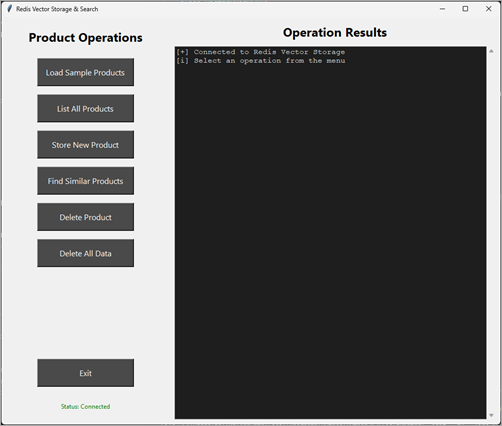

---
lab:
  topic: Azure Managed Redis
  title: Azure Managed Redis でセマンティック検索を実装する
  description: Azure Managed Redis で redis-py や RediSearch を使用して、埋め込みを含む製品ベクトルの保存、セマンティック検索インデックスの作成、類似性検索を行う方法を学びます。
  level: 300
  duration: 30
  islab: true
  primarytopics:
    - Azure
    - Azure Managed Redis
---

# Azure Managed Redis でセマンティック検索を実装する

この演習では、Azure Managed Redis リソースを作成し、ベクトル ストレージ アプリケーションのコードを完成させます。 このアプリケーションは、埋め込みを含むサンプル製品データを読み込み、ベクトル埋め込みとメタデータを含めた新しい製品を保存し、ベクトル埋め込みを使用してセマンティック類似性検索を行い、コサイン類似度に基づいて関連製品を表示します。 ベクトルをメタデータを含むバイナリ データとして保存する、HNSW アルゴリズム構成を使用して RediSearch インデックスを作成する、KNN クエリを実行して意味的に似た製品を見つけるなど、主要なベクトル操作を実装します。

この演習で実行されるタスク:

- プロジェクトのスターター ファイルをダウンロードする
- Azure Managed Redis リソースを作成する
- コードを追加してビジネス ロジックを完成させる
- アプリを実行してサンプル データを読み込み、埋め込み付きの製品を保存し、類似性検索を実行する

この演習の所要時間は約 **30** 分です。

## 開始する前に

演習を最後まで行うには、次のものが必要です。

- エンタープライズ SKU で Azure Managed Redis インスタンスを作成する権限がある Azure サブスクリプション。 まだお持ちでない場合は、[サインアップ](https://azure.microsoft.com/)できます。
- [サポートされているプラットフォーム](https://code.visualstudio.com/docs/supporting/requirements#_platforms)のいずれかにインストールされた [Visual Studio Code](https://code.visualstudio.com/)。
- [Python 3.12](https://www.python.org/downloads/) 以上。
- 最新バージョンの [Azure CLI](https://learn.microsoft.com/cli/azure/install-azure-cli)。
- Azure CLI **redisenterprise** 拡張機能。 **az extension add --name redisenterprise** コマンドを実行するとインストールできます。

## プロジェクト スターター ファイルをダウンロードして Azure Managed Redis をデプロイする

このセクションでは、アプリのスターターファイルをダウンロードし、スクリプトを使って Azure Managed Redis のサブスクリプションへのデプロイを初期化します。 Azure Managed Redis のデプロイが完了するまでに 5 分から 10 分かかります。

1. ブラウザーを開き、次の URL を入力してスターター ファイルをダウンロードします。 ファイルはユーザーの既定のダウンロード場所に保存されます。

    ```
    https://github.com/MicrosoftLearning/mslearn-azure-ai/raw/main/downloads/python/amr-vector-query-python.zip
    ```

1. プロジェクトで作業するシステム内の場所にファイルをコピーまたは移動します。 その後、ファイルをフォルダーに解凍します。

1. Visual Studio Code (VS Code) を起動し、メニューで **[ファイル] > [フォルダーを開く...]** を選択してから、プロジェクト ファイルを含むフォルダーを選びます。

1. プロジェクトには Bash (*azdeploy.sh*) と PowerShell (*azdeploy.ps1*) の両方のデプロイ スクリプトが含まれています。 お使いの環境に適したファイルを開き、スクリプトの先頭にある 2 つの値をニーズに合わせて変更し、変更を保存します。 **注:** スクリプトの他の部分は変更しないでください。

    ```
    "<your-resource-group-name>" # Resource Group name
    "<your-azure-region>" # Azure region for the resources
    ```

1. メニュー バーで、**[ターミナル] > [新しいターミナル]** を選択して、VS Code でターミナル ウィンドウを開きます。

1. 次のコマンドを実行して、Azure アカウントにログインします。 画面の指示に従って、演習用の Azure アカウントとサブスクリプションを選択します。

    ```
    az login
    ```

1. 次のコマンドを実行して、Azure Managed Redis に必要なリソース プロバイダーがご自分のサブスクリプションにあることを確認します。

    ```
    az provider register --namespace Microsoft.Cache
    ```

1. 次のコマンドを実行して、Azure CLI 用の **redisenterprise** 拡張機能をインストールします。

    ```
    az extension add --name redisenterprise
    ```

1. ターミナルで適切なコマンドを実行して、スクリプトを起動します。

    **Bash**
    ```bash
    bash azdeploy.sh
    ```

    **PowerShell**
    ```powershell
    ./azdeploy.ps1
    ```

1. スクリプトの実行中に、「**1**」と入力して **1. Create Azure Managed Redis resource** オプションを起動します。

    このオプションは、リソースグループがまだ存在していなければ作成して、Azure Managed Redis のデプロイを開始します。 このプロセスは Azure のバックグラウンドタスクとして完了します。

1. コンソールに次のメッセージが表示されたら、**Enter** を選択してメニューに戻り、次に **[4]** を選択してスクリプトを終了します。 後でもう一度スクリプトを実行して、デプロイ状況を確認し、プロジェクト用の *.env* ファイルを作成します。

    Azure Managed Redis リソースが作成されており、完了までに 5 分から 10 分かかります。**

    演習の後半でメニューからデプロイ状況を確認できます。**


## Python 環境を構成する

このセクションでは、Python 環境を作成し、依存関係をインストールします。

1. VS Code ターミナルで次のコマンドを実行して、Python 環境を作成します。

    ```
    python -m venv .venv
    ```

1. 次のコマンドを使用して、Python 環境をアクティブ化します。 **注:** Linux/macOS では Bash コマンドを使用します。 Windows では、PowerShell コマンドを使用します。 Windows で Git Bash を使っている場合は、**source .venv/Scripts/activate** を使用します。

    **Bash**
    ```bash
    source .venv/bin/activate
    ```

    **PowerShell**
    ```powershell
    .\.venv\Scripts\Activate.ps1
    ```

1. VS Code ターミナルで次のコマンドを実行して、依存関係をインストールします。

    ```
    pip install -r requirements.txt
    ```

## 管理ベクトル アプリを完成させる

このセクションでは、*manage_vector.py* スクリプトにコードを追加してアプリを完成させます。 Azure Managed Redis リソースが完全にデプロイされていることを確認し、*.env* ファイルを作成してから、演習の後半でアプリを起動します。

1. *manage_vector.py* ファイルを開き、コードの追加を始めます。

>**注:** アプリケーションに追加するコード ブロックは、コードのそのセクションのコメントと一致する必要があります。

### initialization and connection コードを追加する

このセクションでは、redis-py を使って Azure Managed Redis への接続を確立するコードを追加します。 **_connect_to_redis()** 関数は redis-py **Redis** クラスを使って認証付きの安全な SSL 接続を作成します。 **__init__()** メソッドは、セマンティック検索操作用のベクトル インデックスを初期化します。

1. **# BEGIN INITIALIZATION AND CONNECTION CODE SECTION** というコメントを見つけ、コメントの下に次のコードを追加します。 コードの配置が適切かどうかを必ず確認してください。

    ```python
    def __init__(self):
        """Initialize the product manager and establish Redis connection"""
        self.r = self._connect_to_redis()
        self._create_vector_index()  # Create RediSearch index for product embeddings
        self.VECTOR_DIM = 8  # Product embedding dimensionality (matches sample_data.json)

    def _connect_to_redis(self) -> redis.Redis:
        """Establish connection to Azure Managed Redis using SSL encryption and authentication"""
        try:
            # Get connection parameters from environment variables
            redis_host = os.getenv("REDIS_HOST")
            redis_key = os.getenv("REDIS_KEY")

            # Create Redis connection with SSL and authentication
            r = redis.Redis(
                host=redis_host,
                port=10000,  # Azure Managed Redis uses port 10000
                ssl=True,  # Use SSL encryption
                decode_responses=False,  # Keep binary for embeddings - only decode text when needed
                password=redis_key,  # Authentication key
                db=0,  # Connect to database 0 (the default database with RediSearch module)
                socket_timeout=30,  # Connection timeout
                socket_connect_timeout=30,  # Socket timeout
            )

            # Test connection
            r.ping()  # Verify Redis connectivity
            return r

        except redis.ConnectionError as e:
            raise Exception(f"Connection error: {e}")
        except redis.AuthenticationError as e:
            raise Exception(f"Authentication error: {e}")
        except Exception as e:
            raise Exception(f"Unexpected error: {e}")
    ```

1. 変更を保存。

### create vector index コードを追加する

このセクションでは、redis-py 検索モジュールを使ってベクトル類似性検索用の RediSearch インデックスを作成するコードを追加します。 **_create_vector_index()** 関数は、テキスト フィールドと、コサイン類似度を使用した HNSW (階層型ナビゲーション可能スモール ワールド) インデックス用に構成された VectorField を含むスキーマを定義し、効率的なセマンティック検索操作を可能にします。

1. **# BEGIN CREATE VECTOR INDEX CODE SECTION** というコメントを見つけ、コメントの下に次のコードを追加します。 コードの配置が適切かどうかを必ず確認してください。

    ```python
    def _create_vector_index(self):
        """Create a RediSearch index for product semantic search using HNSW algorithm"""
        try:
            # Define schema with embedding field for HNSW-based product similarity search
            # DIM=8 matches our sample data dimensions (in production, this would match your embedding model's output)
            schema = (
                TextField("name"),
                TextField("category"),
                TextField("product_id"),
                VectorField(
                    "embedding",
                    "HNSW",  # Hierarchical Navigable Small World - fast approximate search
                    {
                        "TYPE": "FLOAT32",           # Standard for embeddings
                        "DIM": 8,                    # Must match embedding dimensions in sample_data.json
                        "DISTANCE_METRIC": "COSINE"  # Cosine similarity for semantic search
                    }
                )
            )

            # Create index on hash keys starting with "product:"
            definition = IndexDefinition(
                prefix=["product:"],
                index_type=IndexType.HASH
            )
            self.r.ft("idx:products").create_index(
                fields=schema,
                definition=definition
            )
        except redis.ResponseError as e:
            if "already exists" in str(e):
                pass  # Index already exists, which is fine
            else:
                raise Exception(f"Error creating vector index: {str(e)}")
        except Exception as e:
            raise Exception(f"Error creating vector index: {str(e)}")
    ```

1. 変更を保存。

### store product コードを追加する

このセクションでは、Redis を使ってベクトル埋め込みとメタデータとともに製品を保存するコードを追加します。 **store_product()** 関数は numpy を使って埋め込み配列をバイナリ float32 バイトに変換し、その後 redis-py **hset()** メソッドを使って、Redis のハッシュ構造にバイナリ埋め込みとメタデータ フィールドを保存します。 このアプローチは、ベクトル データの効率的な保存と取得を可能にします。

1. **# BEGIN STORE PRODUCT CODE SECTION** というコメントを見つけ、コメントの下に次のコードを追加します。 コードの配置が適切かどうかを必ず確認してください。

    ```python
    def store_product(self, vector_key: str, vector: list, metadata: dict = None) -> tuple[bool, str]:
        """Store a product with embedding in Redis using hash data structure with binary embedding storage"""
        try:
            # Convert embedding to binary bytes using numpy for efficient storage
            # This follows redis-py best practices for storing embeddings
            embedding = np.array(vector, dtype=np.float32)
            data = {"embedding": embedding.tobytes()}  # Store embedding as binary bytes

            # Add metadata fields to the hash
            if metadata:
                for key, value in metadata.items():
                    data[key] = str(value)

            # Store the hash in Redis using hset() method
            result = self.r.hset(vector_key, mapping=data)

            if result > 0:
                return True, f"Product stored successfully under key '{vector_key}'"
            else:
                return True, f"Product updated successfully under key '{vector_key}'"

        except Exception as e:
            return False, f"Error storing product: {e}"
    ```

1. 変更を保存。

### search similar products ベクトル コードを追加する

このセクションでは、redis-py クライアントで RediSearch を使用してベクトル類似性検索を実行するコードを追加します。 **search_similar_products()** 関数は numpy を使用してクエリ ベクトルをバイナリ float32 バイトに変換した後、RediSearch インデックスに対して KNN (k-nearest ネイバー) クエリを実行して、埋め込みのコサイン類似性に基づいて最も類似した製品を検索します。

1. **# BEGIN SEARCH SIMILAR PRODUCTS CODE SECTION** というコメントを見つけ、コメントの下に次のコードを追加します。 コードの配置が適切かどうかを必ず確認してください。

    ```python
    def search_similar_products(self, query_vector: list, top_k: int = 3) -> tuple[bool, list | str]:
        """Search for products similar to the query vector using RediSearch KNN queries"""
        try:
            # Convert query vector to binary bytes for KNN search
            query_bytes = np.array(query_vector, dtype=np.float32).tobytes()

            # Build KNN query using RediSearch vector search syntax for semantic similarity
            # *=>[KNN k @field_name $query_vec] finds k most similar products based on embedding distance
            knn_query = (
                Query(f"*=>[KNN {top_k} @embedding $query_vec AS score]")
                .return_fields("name", "category", "product_id", "score")
                .sort_by("score")
                .dialect(2)  # Dialect 2 enables vector search syntax
            )

            # Execute KNN search with query vector as parameter
            results = self.r.ft("idx:products").search(
                knn_query,
                query_params={"query_vec": query_bytes}
            )

            if results.total == 0:
                return False, "No products found in Redis. Ensure products are loaded and RediSearch module is enabled."

            # Format results
            similarities = []
            for doc in results.docs:
                similarities.append({
                    "key": doc.id,
                    "similarity": float(doc.score),
                    "product_id": doc.product_id.decode() if isinstance(doc.product_id, bytes) else doc.product_id,
                    "name": doc.name.decode() if isinstance(doc.name, bytes) else doc.name,
                    "category": doc.category.decode() if isinstance(doc.category, bytes) else doc.category
                })

            return True, similarities

        except Exception as e:
            return False, f"Error searching products: {e}"
    ```

1. 変更を保存。

### コードの確認

少し時間をかけて、*manage_vector.py* ファイルのすべてのコードを確認します。

## リソースのデプロイを確認する

このセクションでは、デプロイ スクリプトをもう一度実行して、Azure Managed Redis のデプロイが完了したかどうかを確認し、エンドポイントとアクセス キーの値を持つ *.env* ファイルを作成します。

1. ターミナルで適切なコマンドを実行してデプロイ スクリプトを起動します。 前のターミナルを閉じた場合は、メニューの **[ターミナル] > [新しいターミナル]** を選択して新しいターミナルを開きます。

    **Bash**
    ```bash
    bash azdeploy.sh
    ```

    **PowerShell**
    ```powershell
    ./azdeploy.ps1
    ```

1. デプロイ メニューが表示されたら、「**2**」と入力して、**2. Check deployment status** オプションを実行します。 状態に **Successful** と表示されている場合は、次の手順に進みます。 そうでない場合は、数分待ってから、オプションをもう一度試してみてください。

1. デプロイの完了後、「**3**」と入力して **3. Create database and retrieve endpoint and access key** オプションを実行します。 これにより RediSearch モジュールでデータベースが作成され、アクセス キー認証が可能になり、エンド ポイントとアクセス キーが取得されます。 その後、それらの値を含めた *.env* ファイルが作成されます。

1. *.env* ファイルを確認して値が存在していることを確認し、「**4**」と入力してデプロイ スクリプトを終了します。

## アプリを実行する

このセクションでは、完成したアプリケーションを実行し、ベクトル データの読み込み、保存、検索を練習します。 このアプリは **tkinter** を使って GUI を作成するため、データの表示や管理がより簡単になります。

1. ターミナルで次のコマンドを実行して、アプリを起動します。 コマンドを実行する前に、演習の前半のコマンドを参照して、必要に応じて環境をアクティブ化します。

    ```
    python vectorapp.py
    ```

    アプリケーションは、次の画像のようになります。

    

> **注:** このセクションのすべての手順はこのアプリで実行されます。

### サンプル データを読み込み、類似性検索を行う

このセクションでは、サンプル ベクトル データを Redis に読み込み、類似性検索を行う練習をします。 既知のベクトルを取得し、それをクエリとして使ってデータベース内の意味的に関連した製品を探す練習をします。

1. **[Load Sample Products]** を選択します。 読み込み操作の状況は **[Operation Results]** に表示されます。

1. サンプル データを表示するには、**[すべての製品リスト]** を選択します。 サンプル データには、サンプルデータ内の製品についてのキー、名前、カテゴリ、埋め込みが表示されます。

1. **[Find Similar Products]** を選択し、**[Product Key:]** 入力フィールドに「`product:001`」と入力し、**[Search]** を選択します。

    類似する製品のリストが製品情報、類似度スコアとともに返されます。

### 新しい製品を保存し、類似性検索を行う


1. **[Store New Product]** を選択し、フォームに次の情報を入力し、その後 **[Store Product]** を選択します。 操作結果を確認します。

    Product Key:

    ```
    product:011
    ```

    Embedding:

    ```
    [0.53, 0.63, 0.58, 0.37, 0.68, 0.47, 0.73, 0.57]
    ```

    メタデータ:

    ```
    product_id=011
    name=Gym Bag
    category=Sports
    ```

    > **注:** **[Store New Product]** フォームにそのレコードのプロダクト キーを入力し、他のフィールドを変更して、任意のデータ レコードを編集することもできます。

1. **[Find Similar Products]** を選択し、**[Product Key:]** 入力フィールドに「`product:009`」と入力し、**[Search]** を選択します。

    出力を見直すと、Gym Bag が Premium Backpack に最も類似した製品になっていることに気づきます。

## リソースをクリーンアップする

これで演習が完了したので、不要なリソース使用を避けるために、作成したクラウド リソースを削除してください。

1. VS Code ターミナルで次のコマンドを実行し、リソース グループとグループ内のすべてのリソースを削除します。 **\<rg-name>** を、演習の前半で選択した名前に置き換えます。 このコマンドにより、Azure でバックグラウンド タスクが起動され、リソース グループが削除されます。

    ```
    az group delete --name <rg-name> --no-wait --yes
    ```

> **注:** リソース グループを削除すると、その中のすべてのリソースが削除されます。 この演習で既存のリソース グループを選択した場合は、この演習の範囲外にある既存のリソースも削除されます。

## トラブルシューティング

この演習の実行中に問題が発生した場合は、次のトラブルシューティング手順をお試しください。

**Azure Managed Redis リソースのデプロイを確認する**
- [Azure portal](https://portal.azure.com) に移動してリソース グループを見つけます。
- Azure Managed Redis リソースの **[プロビジョニングの状態]** の表示が **[成功]** であることを確認します。
- リソースの **[公衆ネットワーク アクセス]** が有効で **[アクセス キー認証]** が **[有効]** に設定されているか確認します。

**コードの完全性とインデントを確認する**
- すべてのコード ブロックが正しいセクションと、適切な BEGIN/END コメントマーカーの間に追加されていることを確認します。
- Python のインデントが一貫していること (タブではなくスペースを使用していること)、およびすべてのコードが関数内で正しく配置されていることを確認します。
- 指定されたセクションの外部でコードが誤って削除または変更されていないことを確認します。

**環境変数を確認する**
- *.env* ファイルがプロジェクト フォルダーに存在し、有効な **REDIS_HOST** と **REDIS_KEY** の数値が含まれていることを確認します。
- プロジェクトのルートに *.env* ファイルがある事を確認します。

**Python 環境と依存関係を確認する**
- アプリを実行する前に、仮想環境がアクティブになっていることを確認します。
- **pip list** を実行して、*requirements.txt* のすべてのパッケージが正常にインストールされたことを確認します。

